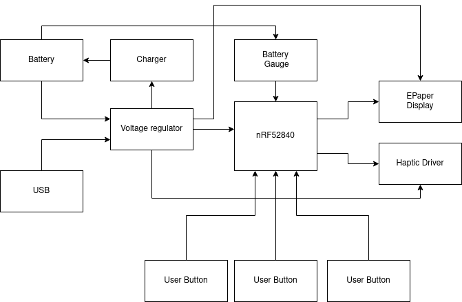

# InkTime

In acest proiect a trebuit implementata o schema electrica data de catre echipa
de TSC in Fusion

## Diagrama bloc

## BOM

|Quantity|Value                                                  |Manufacturer Part Number|Link JLCPARTS                                                            |
|--------|-------------------------------------------------------|------------------------|-------------------------------------------------------------------------|
|1       |2450AT18B100E                                          |2450AT18B100E           |https://jlcpcb.com/partdetail/JohansonDielectrics-2450AT18B100E/C2917717 |
|16      |1uF                                                    |GRM155R70J105KA12D      |https://jlcpcb.com/partdetail/MurataElectronics-GRM155R70J105KA12D/C88945|
|3       |10uF                                                   |CC0402MRX7R6BB106       |https://jlcpcb.com/partdetail/YAGEO-CC0402MRX7R6BB106/C3202927           |
|10      |0.1uF                                                  |CL03A104KP3NNNC         |https://jlcpcb.com/partdetail/50070-CL03A104KP3NNNC/C49062               |
|2       |22uF                                                   |CL05A226MQ5QUNC         |https://jlcpcb.com/partdetail/YAGEO-CC0402MRX7R6BB106/C3202927           |
|5       |4.7uF                                                  |GRM155R61E475ME15D      |https://jlcpcb.com/partdetail/3058877-GRM155R61E475ME15D/C2858031        |
|1       |4.7uF/25V                                              |GRM155R61E475ME15D      |https://jlcpcb.com/partdetail/3058877-GRM155R61E475ME15D/C2858031        |
|1       |47nF                                                   |GRM155R71E473KA88D      |https://jlcpcb.com/partdetail/MurataElectronics-GRM155R71E473KA88D/C77017|
|3       |NC                                                     |                        |                                                                         |
|4       |12pF                                                   |GRM0335C1E120JA01D      |https://jlcpcb.com/partdetail/172753-GRM0335C1E120JA01D/C161372          |
|1       |100pF                                                  |GRM0335C1E101JA01D      |https://jlcpcb.com/partdetail/MurataElectronics-GRM0335C1E101JA01D/C76917|
|2       |1pF                                                    |GRM0335C1E1R0BA01D      |https://jlcpcb.com/partdetail/MurataElectronics-GRM0335C1E1R0BA01D/C88903|
|1       |820pF/NC                                               |GRM0335C1E1R0BA01D      |https://jlcpcb.com/partdetail/MurataElectronics-GRM0335C1E1R0BA01D/C88903|
|1       |USBLC6-2SC6Y                                           |USBLC6-2SC6Y            |https://jlcpcb.com/partdetail/STMicroelectronics-USBLC62SC6Y/C2969755    |
|3       |MBR0530                                                |MBR0530                 |https://jlcpcb.com/partdetail/78464-MBR0530/C77336                       |
|1       |BQ25180YBGR                                            |BQ25180YBGR             |https://jlcpcb.com/partdetail/TexasInstruments-BQ25180YBGR/C3682423      |
|1       |RT6160AWSC                                             |RT6160AWSC              |https://jlcpcb.com/partdetail/RichtekTech-RT6160AWSC/C7065276            |
|1       |BMA423                                                 |BMA423                  |https://jlcpcb.com/partdetail/BoschSensortec-BMA423/C189517              |
|1       |DRV2605YZFR                                            |DRV2605YZFR             |https://jlcpcb.com/partdetail/TexasInstruments-DRV2605YZFR/C81079        |
|1       |503480-2400                                            |503480-2400             |https://jlcpcb.com/partdetail/MOLEX-5034802400/C122434                   |
|1       |KH-TYPE-C-16P_KH-TYPE-C-16P                            |KH-TYPE-C-16P           |https://jlcpcb.com/partdetail/Shenzhen_KinghelmElec-KH_TYPE_C16P/C709357 |
|1       |TC2030-IDC                                             |TC2030-IDC              |-                                                                        |
|1       |FTC252012SR47MBCA                                      |FTC252012SR47MBCA       |https://jlcpcb.com/partdetail/6763488-FTC252012SR47MBCA/C5832368         |
|1       |68uH                                                   |CMI322513J680M          |https://jlcpcb.com/partdetail/61593-CMI322513J680M/C60541                |
|1       |10uH                                                   |SDFL2012S100KTF         |https://jlcpcb.com/partdetail/Sunlord-SDFL2012S100KTF/C1046              |
|1       |15uH                                                   |CMI201209J150KT         |https://jlcpcb.com/partdetail/76759-CMI201209J150KT/C75634               |
|1       |3.9nH                                                  |CMI201209U3R9KT         |https://jlcpcb.com/partdetail/70603-CMI201209U3R9KT/C69486               |
|1       |SI1308EDL-T1-GE3                                       |SI1308EDL-T1-GE3        |https://jlcpcb.com/partdetail/VishayIntertech-SI1308EDL_T1GE3/C469327    |
|1       |20V/4.2A/52mOhm/1.4W                                     |AO3401A                 |https://jlcpcb.com/partdetail/Alpha_OmegaSemicon-AO3401A/C15127          |
|6       |10k                                                    |CR0201FH1002G           |https://jlcpcb.com/partdetail/LIZElec-CR0201FH1002G/C100126              |
|3       |0                                                      |RC0201FR-070RL          |https://jlcpcb.com/partdetail/YAGEO-RC0201FR070RL/C106227                |
|2       |3k3                                                    |RM02JTN332              |https://jlcpcb.com/partdetail/TA_ITech-RM02JTN332/C162771                |
|2       |5k1                                                    |CR0201FH5101G           |https://jlcpcb.com/partdetail/LIZElec-CR0201FH5101G/C100142              |
|1       |0.47                                                   |RL73V1HR47FTDF          |https://jlcpcb.com/partdetail/TEConnectivity-RL73V1HR47FTDF/C2139167     |
|1       |2.2                                                    |RTT012R2JTH             |https://jlcpcb.com/partdetail/RALEC-RTT012R2JTH/C102714                  |
|1       |MAX17048G+T10                                          |MAX17048G+T10           |https://jlcpcb.com/partdetail/2777647-MAX17048GT10/C2682616              |
|1       |NRF52840_QF                                            |NRF52840_QF             |https://jlcpcb.com/partdetail/NordicSemicon-NRF52840_QFAA_FR/C3606918    |
|1       |32Mhz                                                  |830108212909            |https://jlcpcb.com/partdetail/357112-X201632MMB4SI/C383840               |
|1       |32.768kHz                                              |X201632MMB4SI           |https://jlcpcb.com/partdetail/SeikoEpson-Q13FC13500004/C32346            |

## Module folosite

### 1. Mcu

Controlerul principal al placii este un nRF52840, bazat pe un nucleu ARM
Cortex-M4F la 64 MHz.

* Clocking: Sistemul utilizeaza doua ceasuri. Un oscilator extern de 32 MHz
  pentru core, periferice si RF, si oscilator de 32.768 kHz este utilizat
  pentru RTC
* Interfata RF: 2450AT18B100E - banda de 2.4 GHz, integrata cu o retea de
  adaptare a impedantei formata din componente pasive
* Interfete de date:
    * **I2C:** Magistrala pentru senzor IMU, fuel gauge, charger, driver haptic
    * **SPI:** Pentru display-ul E-Paper.
    * **USB:** Liniile D+ ai D- sunt rutate direct la pinii nativi ai nRF52840

### 2. Module

* **Incarcare:** Implementat cu un BQ25180. Preia tensiunea de 5V de pe
  magistrala VBUS (USB) si gestioneaza ciclul de incarcare al celulei LiPo.
  Configurabil folosind I2C + PMIC\_INT
* **Regulatoare:** Buck-boost - Richtek RT6160. Rolul sau este sa asigure o
  tensiune stabila de 3.3V
* **Monitorizare:** MAX17048 citeste starea de incarcare a bateriei. Ofera
  alerte hardware la praguri predefinite de descarcare.
* **Afisaj E-Paper**
* **Sistem Haptic:** - DRV2605. Este comandat prin I2C si activat via pinul
  HAPTIC\_EN`.
* **Inertial Measurement Unit (IMU):** BMA421. Liniile de intrerupere
  (`IMU\_INT1`, `IMU\_INT2`) sunt folosite pentru algoritmul de wake-on-tilt.
* **3 Butoane fizice**

## 3. Calcule Estimative de Consum (Power Budget)

1.  **Standby**: ~10 - 20 uA
2.  **Radio activ (BLE TX/RX): ~5 - 15 mA**
3.  **Actualizare Display (Refresh E-Paper):** ~5 - 15 mA (timp de 1-3 secunde)
4.  **Feedback Haptic:** 50 - 100+ mA pentru perioade scurte

## Pini de nRF52840

Conform manualului de referinta a nRF52840 pinii pentru protocoale digitale (cu
exceptia USB si SWD) pot fi rutati la orice pin fizic ai microcontrollerului.
Alegerea pinilor pentru aceste protocoale a fost facuta pentru a facilita
rutarea de semnale.

